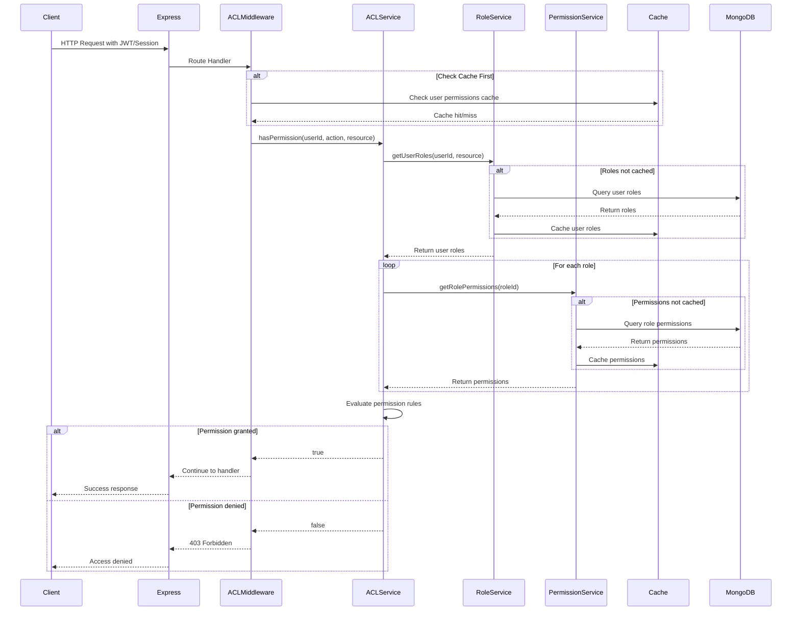

# Authorization Flow Diagram



## Flow Authorization Process:

### 1. Request Phase
- Klient wysyła request z tokenem uwierzytelnienia
- Express przekazuje request do ACL Middleware

### 2. Cache Check
- Sprawdzenie cache dla uprawnień użytkownika
- Jeśli hit - wykorzystanie cached data
- Jeśli miss - pobranie z bazy danych

### 3. Role Resolution
- Pobranie ról przypisanych do użytkownika
- Uwzględnienie zakresu zasobu (resource scope)
- Cache'owanie wyników dla przyszłych requestów

### 4. Permission Evaluation
- Iteracja przez wszystkie role użytkownika
- Pobranie uprawnień dla każdej roli
- Sprawdzenie hierarchii ról (dziedziczenie)

### 5. Decision Making
- Sprawdzenie czy requested action jest dozwolona
- Ewaluacja warunków (conditions) jeśli istnieją
- Zwrócenie decyzji (allow/deny)

### 6. Response
- Jeśli allowed - kontynuacja do handler'a
- Jeśli denied - zwrot 403 Forbidden

## Performance Optimizations:

### Caching Strategy
```javascript
// Cache keys structure
user_roles:{userId}:{resourceType} = [roleIds...]
role_permissions:{roleId} = [permissions...]
user_permissions:{userId}:{resourceType} = [permissions...]

// TTL settings
user_roles: 300s (5 min)
role_permissions: 3600s (1 hour)
user_permissions: 600s (10 min)
```

### Bulk Operations
- Batch loading ról dla grup użytkowników
- Preloading popularnych kombinacji permission
- Background refresh cache'a przed expiry
