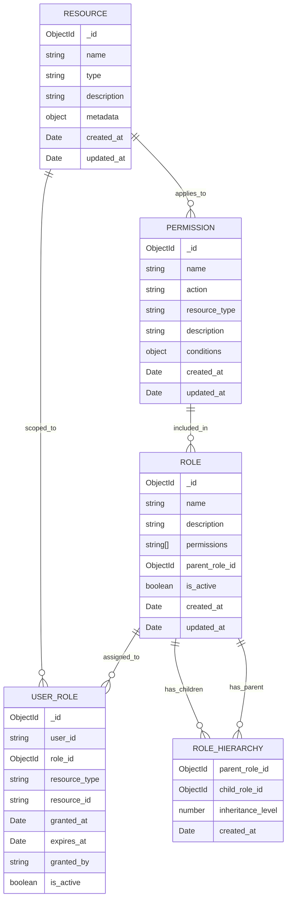

# Data Model Diagram



## Opis modeli:

### ROLE (Role)
- Główna encja reprezentująca rolę w systemie
- Może mieć rodzica (hierarchia ról)
- Zawiera listę uprawnień
- Wspiera dziedziczenie uprawnień z roli nadrzędnej

### USER_ROLE (UserRole Assignment)
- Przypisanie roli do użytkownika
- Może być ograniczone do konkretnego zasobu
- Wspiera czasowe przypisania (expires_at)
- Śledzi kto i kiedy przyznał uprawnienie

### PERMISSION (Permission)
- Definicja konkretnego uprawnienia
- Składa się z akcji (action) i typu zasobu (resource_type)
- Może zawierać warunki (conditions) dla bardziej złożonych reguł
- Przykłady: "read:posts", "write:users", "delete:comments"

### RESOURCE (Resource)
- Definicja chronionego zasobu
- Może reprezentować różne typy obiektów w aplikacji
- Metadata pozwala na dodatkowe informacje kontekstowe

### ROLE_HIERARCHY (Role Hierarchy)
- Definiuje hierarchię między rolami
- inheritance_level określa poziom dziedziczenia
- Umożliwia tworzenie złożonych struktur organizacyjnych

## Przykłady uprawnień:

```javascript
// Podstawowe uprawnienia
"read:posts"     // Czytanie postów
"write:posts"    // Tworzenie/edycja postów
"delete:posts"   // Usuwanie postów
"admin:users"    // Pełne zarządzanie użytkownikami

// Uprawnienia z warunkami
{
  name: "edit:post",
  action: "edit",
  resource_type: "post",
  conditions: {
    owner_only: true,        // Tylko właściciel
    time_limit: "24h"        // W ciągu 24h od utworzenia
  }
}
```
