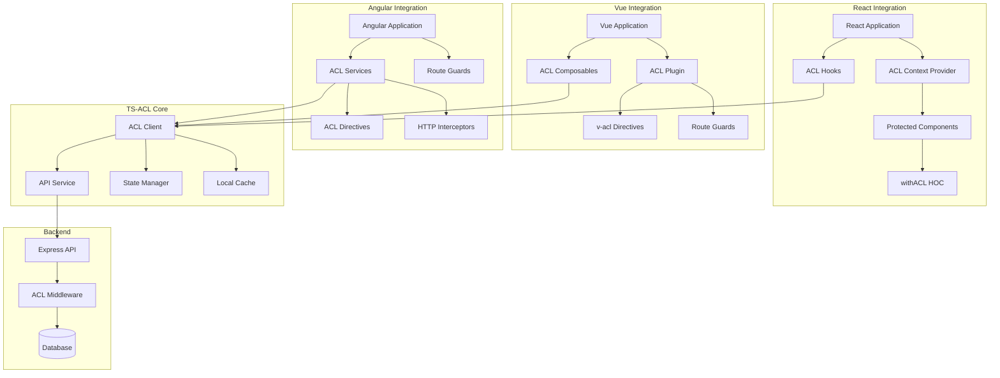

# Frontend Integration Architecture



## Frontend Integration Patterns:

### React Integration (@ts-acl/react)

```tsx
// Context Provider
function App() {
  return (
    <ACLProvider apiUrl="/api/acl" token={userToken}>
      <Router>
        <Routes>
          <Route path="/admin" element={
            <ProtectedRoute permission="admin:access">
              <AdminPanel />
            </ProtectedRoute>
          } />
        </Routes>
      </Router>
    </ACLProvider>
  );
}

// Hooks
function UserProfile() {
  const { hasPermission, isLoading } = useACL();
  const canEdit = hasPermission('edit:profile');
  
  return (
    <div>
      {canEdit && <EditButton />}
      <ConditionalRender permission="view:details">
        <UserDetails />
      </ConditionalRender>
    </div>
  );
}

// HOC
const ProtectedComponent = withACL(
  MyComponent,
  { permission: 'read:data', fallback: <AccessDenied /> }
);
```

### Vue Integration (@ts-acl/vue)

```vue
<!-- Plugin Installation -->
<script>
app.use(ACLPlugin, {
  apiUrl: '/api/acl',
  token: userToken
});
</script>

<!-- Composables -->
<template>
  <div>
    <button v-if="canEdit" @click="edit">Edit</button>
    <div v-acl="'view:details'">
      <UserDetails />
    </div>
  </div>
</template>

<script setup>
import { useACL } from '@ts-acl/vue';

const { hasPermission } = useACL();
const canEdit = hasPermission('edit:profile');
</script>

<!-- Route Guards -->
<script>
const routes = [
  {
    path: '/admin',
    component: AdminPanel,
    beforeEnter: requirePermission('admin:access')
  }
];
</script>
```

### Angular Integration (@ts-acl/angular)

```typescript
// Service Injection
@Component({
  selector: 'app-user-profile',
  template: `
    <button *aclCan="'edit:profile'" (click)="edit()">Edit</button>
    <div *aclCan="'view:details'">
      <app-user-details></app-user-details>
    </div>
  `
})
export class UserProfileComponent {
  constructor(private acl: ACLService) {}
  
  async ngOnInit() {
    const canEdit = await this.acl.hasPermission('edit:profile');
  }
}

// Route Guards
const routes: Routes = [
  {
    path: 'admin',
    component: AdminComponent,
    canActivate: [ACLGuard],
    data: { permission: 'admin:access' }
  }
];

// HTTP Interceptor
@Injectable()
export class ACLInterceptor implements HttpInterceptor {
  intercept(req: HttpRequest<any>, next: HttpHandler) {
    // Automatic permission checking for API calls
    return this.aclService.checkRequestPermission(req)
      .pipe(switchMap(allowed => allowed ? next.handle(req) : throwError('Access denied')));
  }
}
```

## Shared Features Across Frameworks:

### 1. Permission Caching
- Local storage dla offline access
- Memory cache dla performance
- Automatic refresh strategies

### 2. Real-time Updates
- WebSocket support dla live permission changes
- Event-driven updates
- Optimistic UI updates

### 3. Developer Experience
- TypeScript support
- IntelliSense dla permissions
- Development warnings
- Debug tools integration
