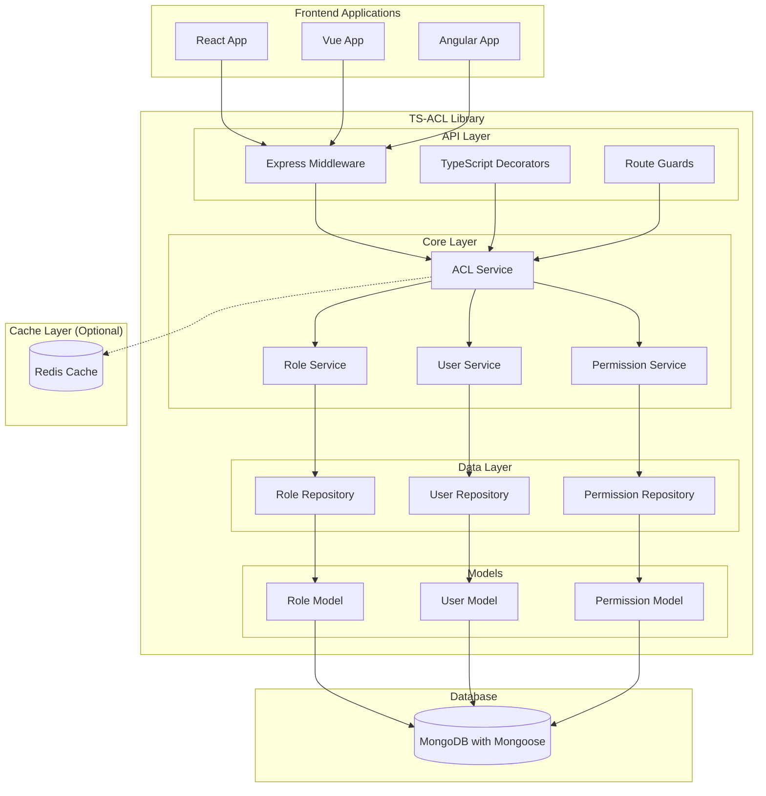

# System Architecture Diagram

## Główne komponenty:

### API Layer
- **Express Middleware**: Automatyczna autoryzacja requestów
- **TypeScript Decorators**: Deklaratywna kontrola dostępu na poziomie metod
- **Route Guards**: Ochrona tras/endpointów

### Core Layer
- **ACL Service**: Główna logika kontroli dostępu
- **Role Service**: Zarządzanie rolami i hierarchiami
- **Permission Service**: Zarządzanie uprawnieniami
- **User Service**: Zarządzanie przypisaniami użytkowników

### Data Layer
- **Repository Pattern**: Abstrakcja dostępu do danych
- **Mongoose Models**: Definicje schematów i walidacja

### Integracje
- **Frontend Libraries**: Dedykowane adaptery dla React/Vue/Angular
- **Caching**: Opcjonalne cachowanie dla wydajności
